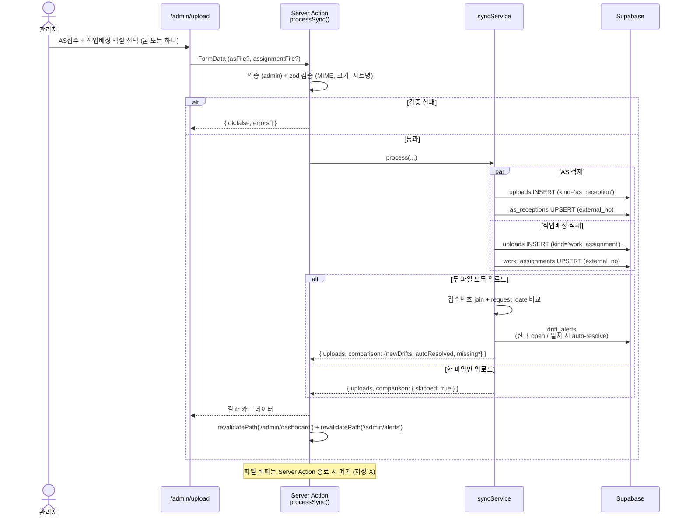
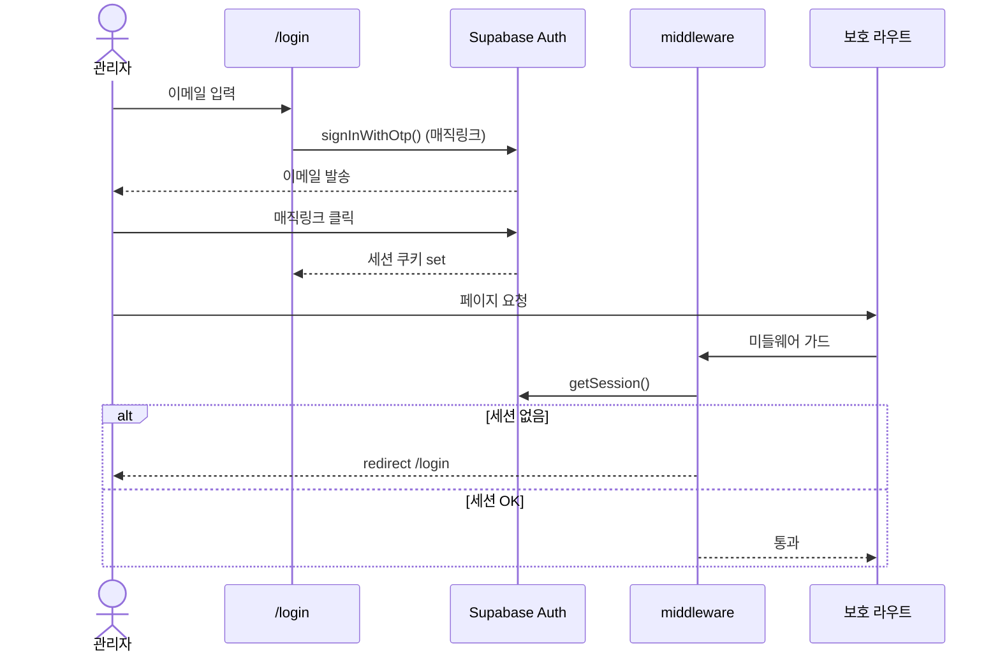

# 05 · 핵심 플로우

상위: [[README]]
관련: [[02-architecture]] · [[03-data-model]] · [[06-permissions]]

## A. 두 엑셀 업로드 → 적재 → drift 검증

> 이 절은 핵심 흐름 요약만 담는다. 화면 / 컬럼 매핑 / 엣지 케이스 / 액션 시그니처 등 세부는 [[specs/data-sync]] 참조.

### 검증 단계

1. **파일 검증** — MIME, 확장자, 크기 상한 (10MB)
2. **시트 검증** — `SV00148` (AS) / `SV00162` (작업배정), 헤더 위치(row 3, 작업배정은 row 5 sub) 인식
3. **행 검증** — `external_no` 정규식 `^AR\d+$`, `request_date` 파싱
4. **무결성 검증** — `external_no` 중복은 첫 행 채택 + 경고 (보통 발생 안 함)

### Upsert / Drift 규칙

상세는 [[03-data-model]] 의 upsert 절, [[specs/data-sync]] 의 drift 알고리즘 참조.

---

## B. 인증 / 세션 (v1)

> v1 은 단일 관리자라 역할 분기 없음. v2 합류 시 `members.role` 조회 단계 추가 ([[roadmap/v2-field]]).

---

## 공통 원칙 (v1)

- **모든 변경은 Server Action 경유** — 클라에서 직접 Supabase mutation 금지
- **에러는 사용자에게 한국어로 명확하게** — Supabase 원문 노출 금지

> 🔮 v2 추가 — 현장 mutation 시퀀스 (audit_log + Realtime broadcast + 낙관적 업데이트). [[roadmap/v2-field]] 참조.
