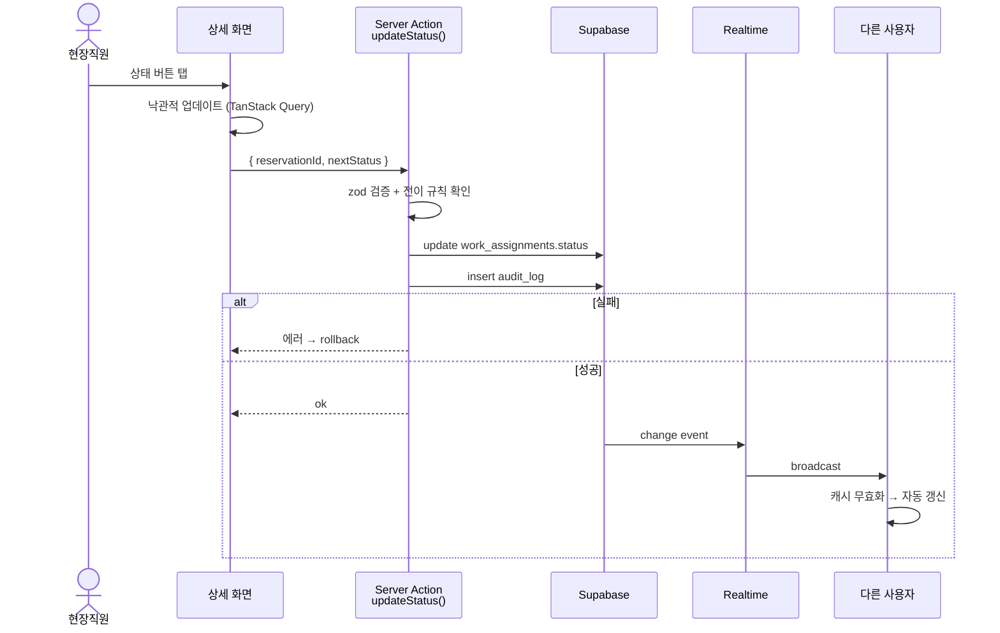

# Roadmap · v2 — DB 영속화 + 현장직원 영역

상위: [[../README]]

> 🔮 **v1 범위 밖**. 이 문서는 v2 작업 시작 시점에 분해되어 본 문서들(03/04/05/06/07/specs)의 해당 섹션으로 흩어진다.
> 지금은 "v1 에서 의도적으로 뺀 것" 의 단일 보관소.

## 배경

v1 은 관리자 1명이 두 엑셀을 업로드 → 클라이언트에서 즉시 비교 → 갱신 필요 항목 확인하는 **무상태 도구**. 데이터를 DB에 저장하지 않고, 페이지 닫으면 결과는 사라진다.

v2 에서 다음 두 가지를 합류시킨다:
- **DB 영속화** — 업로드 이력·테이블 적재·drift 자동 해소 — 운영 데이터로 누적
- **현장직원 영역** — 모바일 PWA로 본인 작업·일정 관리

## v2 에서 추가할 것 (체크리스트)

### A. DB 영속화 — 업로드/적재 ([[../03-data-model]] · [[../specs/data-sync]])

v1 의 클라이언트 비교 (`lib/comparison.ts`) 를 서버로 옮겨 DB 에 저장:

- **`uploads` 테이블** — 업로드 배치 메타 (filename, kind, uploaded_at, 통계)
- **`as_receptions` / `work_assignments` 테이블** — 두 엑셀 적재. `external_no` UNIQUE upsert
- **`drift_alerts` 테이블** — 검출된 drift 이력 + 자동 해소 (`resolved_by='auto'`)
- **`syncService.process(...)` 활성** — Step 3 의 `compareRows()` 결과를 그대로 DB 에 영속화하거나, 서버 측에서 다시 비교 후 저장
- **마이그레이션 적용** — `supabase/migrations/2026042616*.sql` 4개 (이미 작성됨)
- **RLS 활성** — 로그인 SELECT, mutation 은 service_role ([[../06-permissions]])

### B. 대시보드/알림 데이터 연결 ([[../specs/page-dashboard]] · [[../specs/page-alerts]])

페이지는 이미 구현됨 (Phase 4). 데이터 소스만 연결:

- `/admin/dashboard` — drift open count, 통계, 최근 업로드
- `/admin/alerts` — drift_alerts 리스트 + Drawer + kind별 갱신 가이드

### C. 현장직원 데이터 모델 ([[../03-data-model]] 갱신 필요)

- **`members` 테이블 추가** — Supabase `auth.users` 와 1:1 매핑되는 프로파일

  | 컬럼 | 타입 | 설명 |
  |---|---|---|
  | `id` | uuid PK | `auth.users.id` 참조 |
  | `role` | text | `'admin'` / `'field'` |
  | `display_name` | text | |
  | `created_at` | timestamptz | |

- **`work_assignments` 1급 컬럼 승격 후보** (현장 화면에서 자주 쓰임)
  - `assigned_engineer` (text) — 기사 명 (변경 후 우선)
  - `assigned_org` (text) — 관리조직 명 (변경 후 우선)
  - `scheduled_date` (date) — 예정일자 (변경 후)
  - `work_status` (text) — 작업상태

- **`audit_log` 도입** — 현장 mutation 추적
  | 컬럼 | 타입 |
  |---|---|
  | `id` | bigint PK |
  | `target_table` | text (예: `work_assignments`) |
  | `target_id` | uuid |
  | `actor_id` | uuid → auth.users |
  | `action` | text (`status_change` 등) |
  | `before` | jsonb |
  | `after` | jsonb |
  | `created_at` | timestamptz |

### D. 현장직원 라우트 / 페이지 ([[../04-pages]] 갱신 필요)

```
app/
└── (field)/                              # 현장직원 영역 (middleware 가드)
    ├── layout.tsx                        # 모바일 하단탭 / 데스크탑 상단 네비
    ├── reservations/page.tsx             # 오늘/예정 리스트
    ├── reservations/[id]/page.tsx        # 상세 + 상태 변경
    └── schedule/page.tsx                 # 내 스케줄 (캘린더)
```

라우트 가드 추가:

| 경로 | 비로그인 | `field` | `admin` |
|---|---|---|---|
| `/(field)/*` | → `/login` | ✅ | ✅ (열람 가능) |
| `/` | → `/login` | → `/reservations` | → `/dashboard` |

페이지별 컴포넌트:

| 페이지 | 핵심 컴포넌트 |
|---|---|
| `/reservations` | `<ReservationCardList>`, `<DateChips>` |
| `/reservations/[id]` | `<ReservationDetail>`, `<StatusButtons>`, `<NoteForm>` |
| `/schedule` | `<CalendarView>` |

### 플로우 ([[../05-flows]] 갱신 필요)

#### B. 현장 예약 상태 변경



#### 상태 전이 규칙 (TBD)

```
pending → in_progress → done
pending → cancelled
in_progress → cancelled
```

부적합 전이는 Server Action 에서 차단.

### 권한 / RLS ([[../06-permissions]] 갱신 필요)

#### 역할 추가

| 역할 | 식별 | 권한 |
|---|---|---|
| `field` | `members.role = 'field'` | 본인 담당 work_assignments 읽기 + status 컬럼 update만 |

#### RLS 정책 (work_assignments)

```sql
-- field: 본인 담당분만 SELECT
CREATE POLICY work_assignments_field_select ON work_assignments
  FOR SELECT USING (
    assigned_engineer_id = auth.uid()
    OR EXISTS (SELECT 1 FROM members WHERE id = auth.uid() AND role = 'admin')
  );

-- field: 본인 담당분 UPDATE (트리거나 Server Action 으로 status 컬럼만)
CREATE POLICY work_assignments_field_update ON work_assignments
  FOR UPDATE USING (assigned_engineer_id = auth.uid())
  WITH CHECK (assigned_engineer_id = auth.uid());
```

> 컬럼 단위 제어는 RLS 만으로 어려움 — Server Action 경유 + service_role 정책으로 status 외 컬럼 변경 차단.

#### 현장직원 계정 발급 (구 OQ-3)

미정 — v2 시작 시점에 운영 정책 확인:
- (a) 관리자가 초대 링크 발송
- (b) 사번/번호로 사전 등록 + 첫 로그인 시 비밀번호 설정

### PWA ([[../07-pwa-responsive]] 갱신 필요)

#### 도입 도구

`@ducanh2912/next-pwa` — Next 15 호환

#### manifest

```json
{
  "name": "Clean Scheduler",
  "short_name": "Scheduler",
  "start_url": "/reservations",
  "display": "standalone",
  "orientation": "portrait",
  "background_color": "#ffffff",
  "theme_color": "#0f172a"
}
```

#### Service Worker 캐시

| 리소스 | 전략 |
|---|---|
| HTML / RSC 응답 | NetworkFirst |
| `_next/static/*` | CacheFirst |
| Supabase API | NetworkOnly |
| 이미지 | StaleWhileRevalidate |

#### iOS 주의

- "홈 화면에 추가" 안내 컴포넌트 필요
- `apple-touch-icon` 별도 제공
- SW 저장소 한도 모니터링

### 반응형 우선순위 변경

v1 = 데스크탑 우선. v2 추가 시 (field) 영역만 **모바일 우선** 으로 가져간다.

| 영역 | v1 | v2 |
|---|---|---|
| `(admin)/*` | 데스크탑 우선 | 데스크탑 우선 (변경 없음) |
| `(field)/*` | — | **모바일 우선** (320px+) |

레이아웃:

| 영역 | Mobile (< 768px) | Desktop (≥ 768px) |
|---|---|---|
| `(field)` | 하단 탭바 + 본문 | 상단 네비 + max-w-3xl |

## v2 시작 시 작업 순서 (제안)

1. 본 문서를 03/04/05/06/07 로 분해 + status 라벨 갱신
2. `members` 테이블 마이그레이션
3. 인증 흐름에 role 분기 추가
4. `(field)` 라우트 + 페이지
5. work_assignments 1급 컬럼 승격 마이그레이션
6. RLS 정책 + audit_log
7. PWA 도입 + manifest
8. 모바일 우선 디자인 적용

## 미해결 (v2 착수 전 결정 필요)

- 현장직원 계정 발급 방식 (위 참조)
- `assigned_engineer_id` 매핑 — 작업배정관리 엑셀의 "기사 명/번호" 와 `members` 의 매칭 정책 (이름 기준? 별도 매핑 테이블?)
- 모바일 인증 — 매직링크 vs 비밀번호 (현장 환경에서 이메일 접근성 고려)
