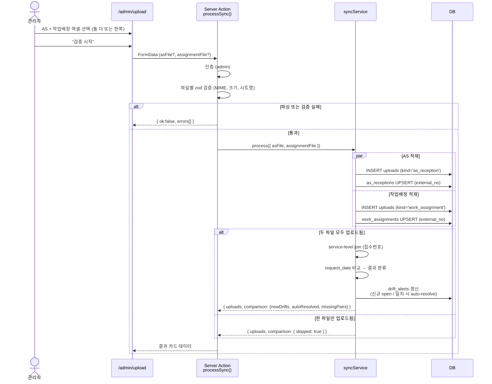

# Spec · 데이터 동기화 (AS접수 ↔ 작업배정)

상위: [[../README]]
관련: [[../03-data-model]] · [[../04-pages]] · [[../05-flows]] · [[../08-code-structure]]

## 목적

AS접수리스트와 작업배정관리 두 엑셀에서 같은 접수번호를 가진 row 의 **요청일자** 차이를 자동 탐지하고, AS 엑셀의 수동 갱신 필요성을 관리자에게 알린다. 갱신이 반영되면 자동으로 해소(closed) 한다.

## 도메인 배경

- 고객이 A/S 요청일자를 변경하면 작업배정관리에는 즉시 반영되나, AS접수리스트엔 자동 반영되지 않는다.
- 운영팀은 두 엑셀을 주기적으로 받아 AS 엑셀을 **수동 갱신** 해야 한다.
- 시스템은 갱신이 필요한 row 를 정확히 알려주는 데 집중.

## 입력 파일

| 파일 | 시트 | 헤더 위치 | 데이터 시작 | 컬럼 수 |
|---|---|---|---|---|
| AS접수리스트_*.xlsx | `SV00148` | row 3 (단일 헤더) | row 4 | 43 |
| 작업배정관리_*.xlsx | `SV00162` | row 3 (메인) + row 5 (변경 전/후 sub) | row 6 | 58 |

## 핵심 룰

| 항목 | 결정 |
|---|---|
| **조인 키** | 접수번호 (AS의 `접수 번호` / 작업배정의 `접수번호`, 모두 `AR…` 포맷) |
| **비교 컬럼** | AS의 `A/S요청일자` ↔ 작업배정의 `요청일자` |
| **drift 판정** | 두 값이 다르면 `drift_alerts` open. 정규화된 `date` 로 비교 (시간/공백 무시) |
| **자동 해소** | 재업로드 시 일치하면 `resolved_at = now(), resolved_by = 'auto'` |
| **누락도 drift** | 한쪽에만 존재하는 접수번호도 `kind='missing_*'` 로 기록 |
| **단일 파일 업로드** | 허용. 적재만, 비교는 skip |

## 처리 흐름



## 컬럼 매핑 (엑셀 → DB)

### AS접수리스트 → `as_receptions`

| 엑셀 컬럼 | DB 컬럼 | 비고 |
|---|---|---|
| `접수 번호` (col 9) | `external_no` | 정규식 `^AR\d+$` 검증 |
| `A/S요청일자` (col 6) | `request_date` | date 정규화 |
| `고객명` (col 15) | `customer_name` | |
| (그 외 모든 컬럼) | `raw.<원본 헤더명>` | jsonb 평탄화 |

### 작업배정관리 → `work_assignments`

| 엑셀 컬럼 | DB 컬럼 | 비고 |
|---|---|---|
| `접수번호` (col 21) | `external_no` | 정규식 `^AR\d+$` 검증 |
| `요청일자` (col 3) | `request_date` | date 정규화 |
| `고객명` (col 16) | `customer_name` | |
| (그 외 모든 컬럼) | `raw.<원본 헤더명>` | jsonb. 멀티헤더는 `'변경 전.기사 명'` 같이 dot-prefix 로 평탄화 |

## drift 판정 알고리즘

```ts
type Pair = {
  externalNo: string;
  asDate: Date | null;
  assignmentDate: Date | null;
  asExists: boolean;
  assignmentExists: boolean;
};

function classify(p: Pair): 'mismatch' | 'missing_in_assignment' | 'missing_in_as' | 'ok' {
  if (p.asExists && !p.assignmentExists) return 'missing_in_assignment';
  if (!p.asExists && p.assignmentExists) return 'missing_in_as';
  if (p.asDate?.getTime() !== p.assignmentDate?.getTime()) return 'mismatch';
  return 'ok';
}
```

### drift_alerts 라이프사이클

```
[비교 시점]
  ├─ classify == 'ok'    → 기존 open 이 있으면 auto-resolve, 없으면 무동작
  └─ classify != 'ok'   → 기존 open 이 없으면 신규 row insert (resolved_at=null)
                          기존 open 이 있으면 detected_at, last_upload_id 갱신
```

> 동일 `(external_no, field)` 의 open row 는 최대 1개. 해소된 후 다시 어긋나면 새 row 생성 → 이력 누적.

## 엣지 케이스 (확정)

| 케이스 | 동작 | 근거 |
|---|---|---|
| 한 파일만 업로드 | 허용. 적재만, 비교 skip. 결과 카드에 `skipped: true` 표시 | 운영 유연성 |
| 한쪽에만 존재하는 접수번호 | `kind='missing_in_*'` 로 drift_alerts 에 기록 | 누락 운영 추적 |
| 같은 파일 중복 업로드 | upsert 멱등 + 비교 idempotent | 안전 |
| `request_date` 한쪽만 빈값 | mismatch 로 drift | 빈값도 정보 |
| 양쪽 모두 빈값 | `ok` 로 판정, drift 없음 | 비교 의미 없음 |
| 첫 업로드 (이전 데이터 0) | 양쪽 신규 적재 후 비교 | 자동 처리 |

## 검증 룰 (zod)

```ts
const FileSchema = z.object({
  size: z.number().max(10 * 1024 * 1024), // 10MB
  type: z.string().regex(/spreadsheetml/),
});

const AsRowSchema = z.object({
  external_no: z.string().regex(/^AR\d+$/),
  request_date: z.coerce.date().nullable(),
  customer_name: z.string().min(1),
});

const AssignmentRowSchema = z.object({
  external_no: z.string().regex(/^AR\d+$/),
  request_date: z.coerce.date().nullable(),
  customer_name: z.string().min(1),
});
```

> `raw` 에 들어갈 추가 필드는 검증하지 않음 (보존만).

## 화면 spec

### `/admin/upload`

**상태 머신**

```
idle ─(파일 선택)─▶ ready ─(클릭)─▶ processing ─▶ result
                                              └─▶ error
```

**컴포넌트 구성**

```
<UploadPage>
  <DualDropZone>
    <DropSlot kind="as_reception" />
    <DropSlot kind="work_assignment" />
  </DualDropZone>
  <SubmitBar>           // 한 파일만이라도 있으면 활성, 안내 문구 변동
  <ResultCard>          // processing → 결과
    <CountTile label="신규 적재" />
    <CountTile label="갱신" />
    <CountTile label="drift 신규 open" />
    <CountTile label="자동 해소" />
    <ErrorList />
  </ResultCard>
</UploadPage>
```

### `/admin/dashboard`

- 상단 알림 카드: **미해소 drift 수** (open만, `resolved_at IS NULL`).
  - 클릭 → `/admin/alerts`
- 본문: 최근 업로드 이력 5건, 적재 통계.

### `/admin/alerts`

- 미해소 drift 리스트 — 컬럼: `접수번호`, `kind`, `고객명`, `AS 요청일자`, `작업배정 요청일자`, `검출일시`
- 행 클릭 → 상세 패널 (raw 비교, 갱신 가이드 안내)
- 정렬: 검출일시 내림차순 기본
- (미래) 강제 dismiss 액션

## Server Action 시그니처

```ts
// src/actions/sync.actions.ts
"use server";

export type ProcessSyncResult =
  | {
      ok: true;
      uploads: {
        asReception?: UploadSummary;
        workAssignment?: UploadSummary;
      };
      comparison:
        | { skipped: true; reason: 'single_file' }
        | {
            skipped: false;
            newDrifts: number;        // 신규 open
            autoResolved: number;     // 자동 해소
            missingInAs: number;
            missingInAssignment: number;
          };
    }
  | { ok: false; errors: ValidationError[] };

type UploadSummary = {
  uploadId: string;
  totalRows: number;
  inserted: number;
  updated: number;
  errorsCount: number;
};

export async function processSync(formData: FormData): Promise<ProcessSyncResult>;
```

## 구현 가이드 ([[../08-code-structure]] 정합)

```
[/admin/upload page (RSC + form)]
   └─ <UploadForm action={processSync} />

[src/actions/sync.actions.ts]      ← Server Action
   - 인증 (admin only)
   - 파일 zod 검증
   - syncService.process({ asFile?, assignmentFile?, userId })

[src/services/sync.service.ts]
   - 파일 파싱 (lib/parsers/excel.ts)
   - asReceptionRepo.upsertBatch / workAssignmentRepo.upsertBatch
   - 비교 가능하면: driftService.compareAndApply(...)

[src/services/drift.service.ts]
   - 두 테이블에서 union(external_no) 모두 fetch
   - classify() 로 분류
   - driftAlertRepo.upsertOpenOrResolve(...)

[src/repositories/]
   - as_reception.repo.ts
   - work_assignment.repo.ts
   - drift_alert.repo.ts
   - upload.repo.ts

[src/lib/parsers/excel.ts]
   - SheetJS wrapper
   - AS / 작업배정 헤더 위치 인식 (row 3 / row 3+5)
   - 멀티헤더 평탄화 룰 (변경 전/후 → dot prefix)
```

## 비기능 요구

- 처리 시간: 1만 행 기준 5초 이내 목표 (Server Action 타임아웃 고려, 필요 시 RPC/Edge Function 으로 이동)
- 동시 업로드: admin 1명만 사용한다는 가정. 락은 도입하지 않음 (운영 단계에서 재검토)

## TBD (이 spec 범위 밖)

- 강제 dismiss UX (drift_alerts.resolved_by='manual')
- 미래 비교 컬럼 확장 (예: 기사 명, 예정일자)
- 푸시/이메일 알림
- 업로드 이력 페이지 (`/admin/uploads`)
