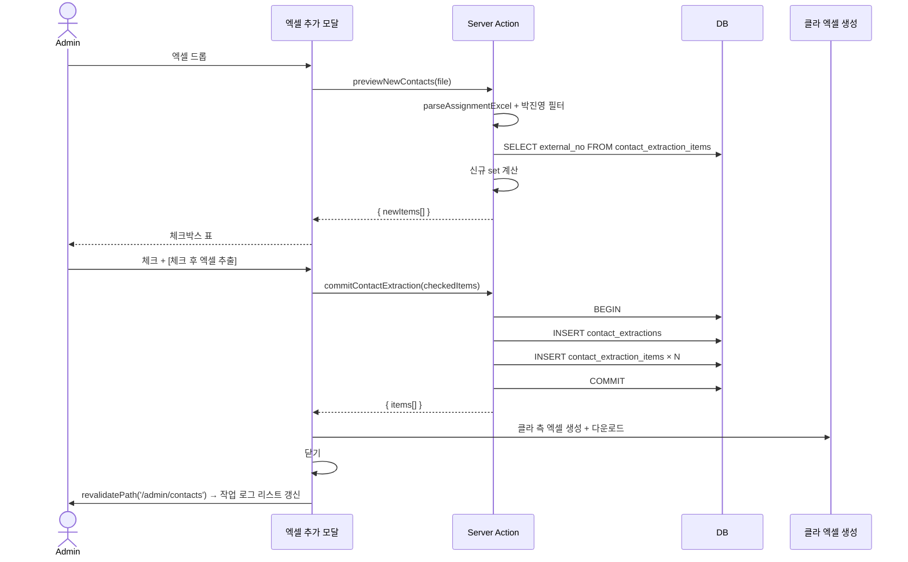

# Spec · `/admin/contacts` — 신규 접수

상위: [[../README]]
관련: [[../03-data-model]] · [[../04-pages]] · [[../08-code-structure]] · [[page-upload]]

## 목적

박진영(고정 담당자) 의 작업배정 행 중 **DB 에 한 번도 추출 등록되지 않은 신규 접수번호** 를 골라 컨택 전화번호 안내용 엑셀로 출력한다. 출력된 항목은 DB 에 영속되어 다음 업로드부터 "신규 아님" 으로 자동 제외된다.

## 도메인 배경

- 영업/배정 흐름에서 새로 들어온 작업은 박진영이 우선 받음 (변경 전.기사 명 = 박진영)
- 운영자는 이 신규 접수에 대해 컨택 전화번호 안내 엑셀을 만들어 발송
- "한 번 발송한 접수번호는 다시 발송하지 않는다" — 그 이력을 DB 가 보관

## 페이지 진입 / 위치

- 라우트: `/admin/contacts`
- 사이드바 라벨: **"신규 접수"**
- 진입: 사이드바에서 직접

## 화면 구성

```
┌──────────────────────────────────────────────────┐
│  신규 접수                          [+ 엑셀 추가] │
├──────────────────────────────────────────────────┤
│  작업 로그                                       │
│  ┌─────────────┬───────────────┐                │
│  │ 추출일      │ 체크 작업 수  │                │
│  ├─────────────┼───────────────┤                │
│  │ 2026-04-26  │ 8             │ ← 클릭 시 상세  │
│  │ 2026-04-25  │ 12            │                │
│  │ ...                          │                │
│  └─────────────┴───────────────┘                │
│  [페이지네이션]                                  │
├──────────────────────────────────────────────────┤
│  리스트 상세 (선택된 작업 로그)                  │
│  ┌─────────────────────────────────────────────┐│
│  │ 접수번호 │ 주문일자 │ 요청일자 │ 약속 │ 고객명│ 전화 ││
│  │ AR..    │ ...      │ ...      │ ...  │ ... │ ... ││
│  └─────────────────────────────────────────────┘│
└──────────────────────────────────────────────────┘
```

- 작업 로그 행 클릭 → 하단 상세 패널 갱신 (별도 라우트 X)
- 상세 패널: 6컬럼 — 접수번호 / 주문일자 / 요청일자 / 기사약속시간 / 고객명 / 컨택 전화번호

## [+ 엑셀 추가] 모달 흐름

```
┌─ 모달: 신규 접수 추출 ─────────────────────────┐
│                                                 │
│  ① 작업배정 엑셀 업로드 (드롭존)                │
│        ↓ 자동 분석                              │
│  ② 박진영(변경 전.기사 명) 담당 행 추출         │
│        ↓                                        │
│  ③ DB 의 contact_extraction_items 와 비교       │
│     → external_no 가 등록 안 된 행만 = 신규     │
│        ↓                                        │
│  ④ 신규 행 표 + 체크박스                        │
│  ┌─────────────────────────────────────────┐   │
│  │ ☐ 접수번호 │ 주문일자 │ 요청일자 │ ...    │   │
│  │ ☐ AR..    │ ...                         │   │
│  │ ☑ AR..                                   │   │
│  └─────────────────────────────────────────┘   │
│                                                 │
│           [체크 후 엑셀 추출]    [×]            │
└────────────────────────────────────────────────┘
```

### 모달 닫힘 조건

| 액션 | 결과 |
|---|---|
| `[체크 후 엑셀 추출]` | 트랜잭션: extractions + items insert + 엑셀 다운로드 → 모달 닫힘 + 작업 로그 리스트 갱신 |
| `[×]` | DB 변경 없음. 모달 닫힘 |
| ESC / 바깥 클릭 | **차단** — 두 가지 액션으로만 닫혀야 (실수 방지) |

> 트랜잭션 의도: 사용자가 체크+추출 안 하면 다음 업로드에도 같은 행이 신규로 등장 (idempotent).

### 박진영 필터

```ts
parsedRows.filter(r =>
  r.assigned_engineer_before === "박진영"
)
```

- `assigned_engineer_before` = ParsedAssignmentRow 의 1급 컬럼 (col 42 — 변경 전.기사 명)
- 박진영 외 다른 담당자는 v1 에서 노출 안 함 (필터 고정)
- v2 에서 담당자 선택 가능하게 확장 검토

### 신규 비교

```sql
SELECT external_no FROM contact_extraction_items
```

→ 클라이언트(또는 server) 가 이 set 과 박진영 필터링된 rows 의 external_no 를 비교. set 에 없는 것만 모달에 표시.

## 컴포넌트 트리

```
<ContactsPage>                        (RSC)
  ├─ <PageHeader title="신규 접수">
  │    └─ <AddExcelButton />          (Client — 모달 트리거)
  ├─ <WorkLogList>                    (RSC + RouterCache)
  │    ├─ row(s) — clickable → set selectedLogId (URL ?log=)
  │    └─ <Pagination />              (URL ?page=)
  └─ <WorkLogDetail logId={...}/>     (RSC — 6컬럼 표)

<ExcelAddModal>                       (Client — Dialog)
  ├─ <DropPanel> (idle)
  ├─ <LoadingPanel> (pending)
  ├─ <ErrorPanel> (failed)
  └─ <NewItemsTable>                  (체크박스 + [체크 후 엑셀 추출])
```

## Server Action 시그니처

```ts
// src/actions/contacts.actions.ts

/** 모달 ① — 엑셀 파싱 + 박진영 필터 + DB 비교 → 신규 row 반환 */
async function previewNewContacts(
  _prev: NewContactsPreview | null,
  formData: FormData,
): Promise<NewContactsPreview>;
// 반환: { ok, total, filtered (박진영), newCount, newItems[] }

/** 모달 ④ — 트랜잭션: extractions + items insert. 엑셀 데이터 반환 (클라가 다운로드 트리거) */
async function commitContactExtraction(
  selected: NewContactItem[],
): Promise<CommitResult>;
// 반환: { ok, extractionId, items[] (체크된 거) }
```

> 엑셀 다운로드는 클라에서 `xlsx` 라이브러리로 만들기 (server response 가벼움 + 사용자 PC 에서 즉시 다운로드).

## 데이터 흐름



## 4-layer 정합

```
[ContactsPage / Modal]   ─→  Server Action  ─→  Service        ─→  Repository
                                                                  ↓
                                                                Supabase
```

- `repositories/contact_extraction.repo.ts` — `listLogs(page)`, `getItems(logId)`, `getExistingExternalNos()`, `createWithItems(extraction, items)` (트랜잭션)
- `services/contact_extraction.service.ts` — 박진영 필터 + 신규 비교 + commit 오케스트레이션
- `actions/contacts.actions.ts` — 인증 + zod + service 위임

## 컬럼 매핑 (작업배정 → contact_extraction_items)

| 엑셀 컬럼 | 필드 | 비고 |
|---|---|---|
| 접수번호 (col 21) | `external_no` | UNIQUE |
| 주문일자 (col 2) | `order_date` | |
| 요청일자 (col 3) | `request_date` | |
| 기사 약속시간 (col 4) | `promised_time` | text |
| 고객명 (col 16) | `customer_name` | |
| 컨택 전화번호 (col 12) | `contact_phone` | text — 새 1급 |

## 엑셀 출력 형식

| 컬럼 | 출처 |
|---|---|
| 접수번호 | external_no |
| 주문일자 | order_date |
| 요청일자 | request_date |
| 기사 약속시간 | promised_time |
| 고객명 | customer_name |
| 컨택 전화번호 | contact_phone |

파일명: `신규접수_YYYYMMDD_HHmm.xlsx`

## v1 에서 의도적으로 안 하는 것

- 박진영 외 담당자 선택 (필터 고정)
- 추출 후 "재발송" / "수정" — 한 번 추출하면 영구 고정
- 이력의 export 결과를 다시 엑셀로 다운로드 — TBD

## TBD

- 작업 로그 페이지네이션 페이지 크기 (10? 20?)
- 미체크 항목을 기록할지 (현재는 변경 없음 — 다음 업로드에 다시 신규로 등장)
- 박진영 외 담당자 추가 (v2 검토)
